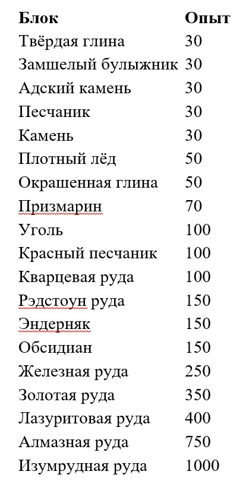
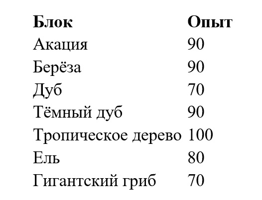
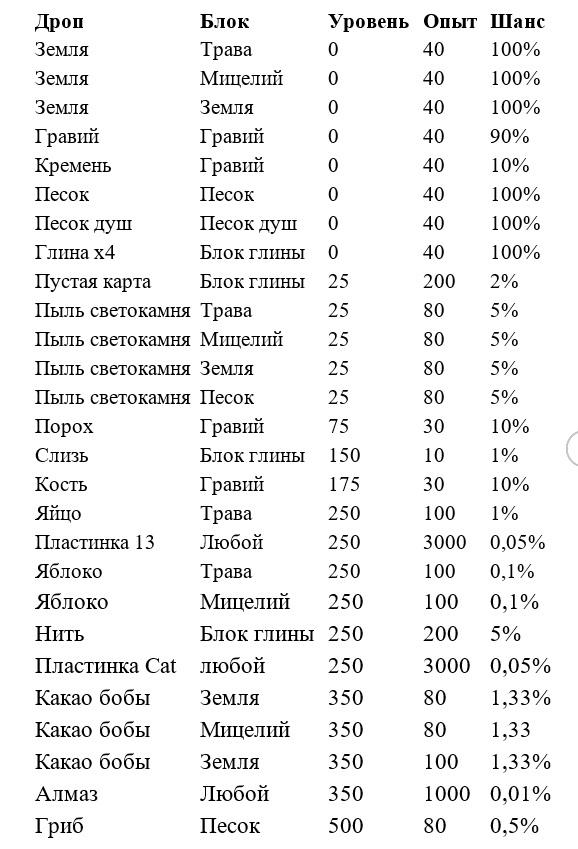
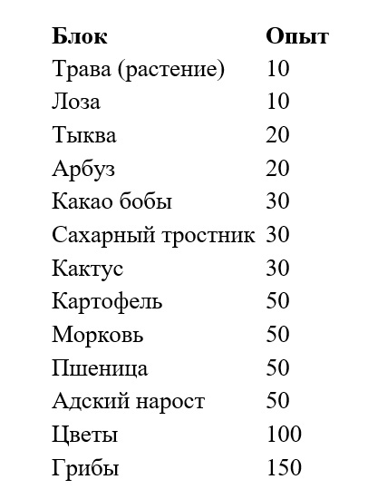
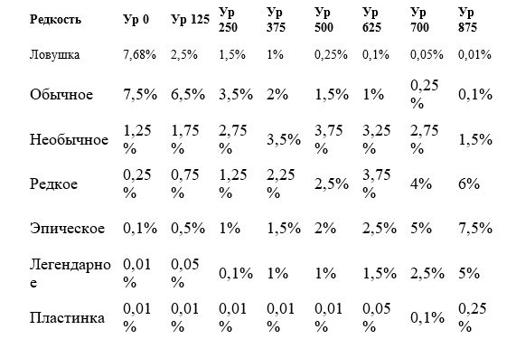
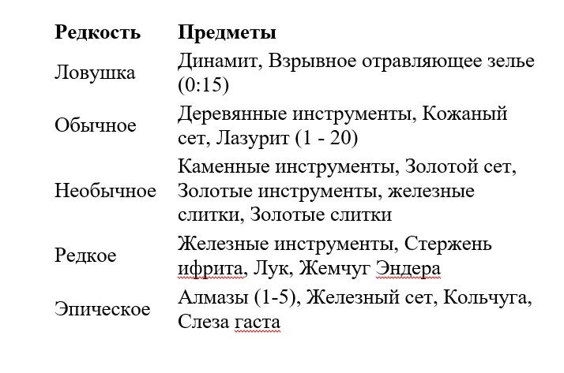
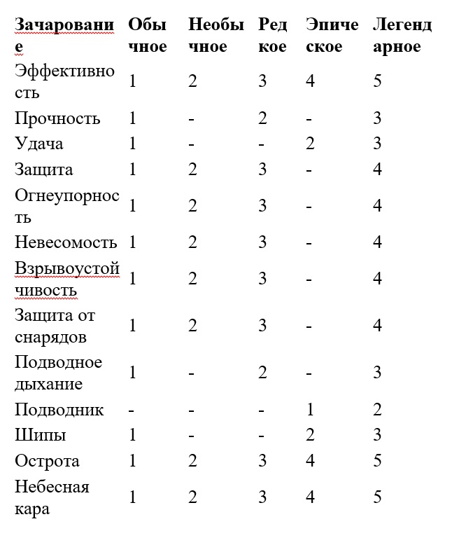
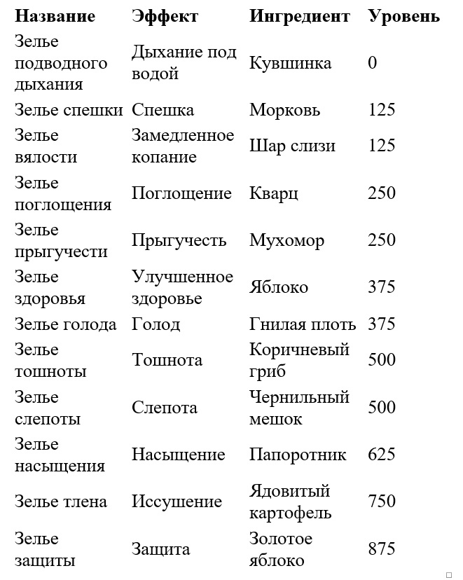
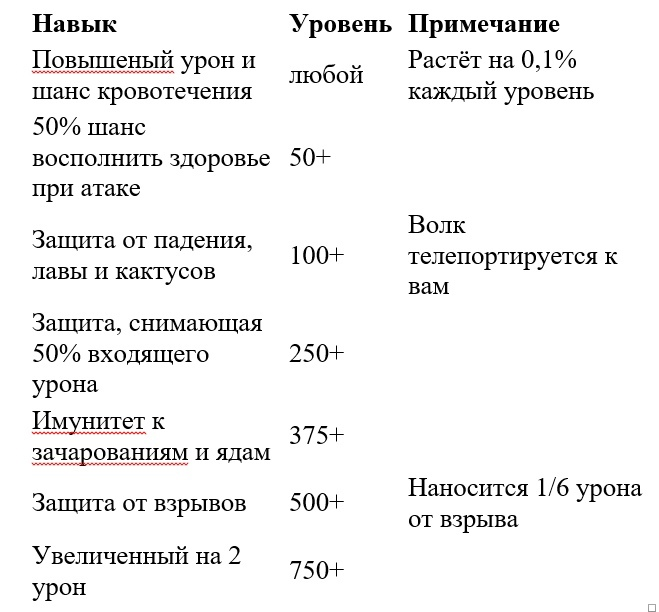

# McMMO

Итак, на сервере есть такой замечательный плагин как McMMO, но что он нам даёт? А вот что: он добавляет элементы рпг в виде навыков. Всего их 13 и каждый навык мы рассмотрим по порядку, что за навык, зачем он и как прокачать.

## Шахтерство ⛏

Шахтерство включает в себя добычу камня и руд. Оно дает шанс, что некоторые редкие материалы будут найдены во время добычи.

**ЧТО ДАЁТ**

- Двойной дроп руд и блоков, которые копаются при помощи кирки, шанс дропа увеличивается на 0,1% каждый уровень, до 100% на 1000 уровне (предел)

- Увеличенный дроп при подрыве динамитом, однако недоступен до 125 уровня, а после него уменьшается потеря блоков, вплоть до полного отсутствия потери, затем поднимается процент добычи руды.

- Динамит имеет повышенный радиус подрыва, начиная с 375 уровня.

- В качестве скилла (ПКМ) увеличенная скорость добычи блоков, временная, на 0-м уровне 2 секунды, каждые 50 уровней +1 секунда, вплоть до 22 секунд на 1000 уровне, откат не зависит от уровня и составляет 240 секунд (4 минуты). Сильно изнашивает инструмент.

**ПОЛУЧЕНИЕ ОПЫТА**

Чтобы получать опыт, вы должны вести добычу с киркой в руке. Опыт дается за добычу определенных блоков.

**УМЕНИЯ**

- Суперкрушитель - это умение, связанное с навыком Шахтерство. Оно утраивает шанс получить дополнительные предметы и разрушает подходящие блоки с одного удара.

- Подрывная добыча - умение с откатом, связанное с навыком Шахтерство. Оно дает бонусы при добыче с динамитом и позволяет взрывать его на расстоянии. Есть три особенности Подрывной добычи.  Первая - умение Большие бомбы, которое увеличивает радиус взрыва динамита. Вторая - умение Экспертиза подрывов, которое уменьшает  полученные вами повреждения от взрыва TNT. Третья - уменьшение добычи простых камней и увеличение добычи полезных руд.

**КАК ИСПОЛЬЗОВАТЬ УМЕНИЕ**

- Суперкрушитель: С киркой в руке кликните ПКМ, чтобы подготовить инструмент. После этого у вас есть около 4 секунд для начала добычи подходящих блоков, что активирует умение Суперкрушитель.

- Подрывная добыча: С киркой в руке, присядьте и нажмите ПКМ по динамиту с расстояния. Это  мгновенно приведет к подрыву динамита.

::: tip Таблица

:::

## Лесорубство 🪓

Лесорубство - это все, что касается рубки деревьев.

**ЧТО ДАЁТ**

- Двойной дроп блоков древесины, аналогично шахтёрству.

- Повышенный шанс дропа ростка, при уничтожении блока листвы топором, с 100 уровня.

- Как активный скилл (ПКМ) мгновенное срубание дерева, время действия и отката аналогичны шахтёрскому скиллу. Срубить можно дерево не более 500 блоков. Сильно изнашивает инструмент.

**ПОЛУЧЕНИЕ ОПЫТА**

- Опыт дается при разрушении блоков древесины.

**УМЕНИЯ**

- Дровосек - это активное умение, которое активируется нажатием ПКМ с топором в руке. Это приведет к тому,  что все дерево вмиг будет срублено, а все блоки древесины выпадут за раз.

- Сдуватель листьев - пассивное умение, которое приводит к тому, что блоки листвы вмиг разрушаются при ударе топором.  Это умение разблокируется на уровне 100.

- Двойная добыча - это пассивное умение, дающее шанс выпадения дополнительного блока древесины при рубке.

::: tip Таблица

:::

## Раскопки 🪱

Раскопки - процесс копания земли в поисках сокровищ. В процессе раскопок вы можете найти сокровища. Чем больше вы копаете, тем больше сокровищ вы можете найти.

**ЧТО ДАЁТ**

- Особый дроп с каждого блока земли, песка, графия, песка душ, травы, глины или мицелия.

**ПОЛУЧЕНИЕ ОПЫТА**

- Чтобы получать опыт за этот навык, вы должны копать с лопатой в руке. Только определенные блоки при копании дают опыт и содержат сокровища.

**УМЕНИЯ**

- Гига-бур - это умение с откатом, связанное с навыком Раскопок. Оно утраивает шанс найти сокровища и дает возможность разрушать подходящие блоки с одного удара.

- Все сокровища навыка Раскопок имеют свой требуемый уровень навыка, так что сложно сказать, насколько сильно вам поможет этот навык. Просто помните, что чем выше ваш навык Раскопок, тем больше сокровищ вы сможете найти. Также не забывайте, что для каждого совместимого с Раскопками блока имеются свои уникальные сокровища. Другими словами, в земле вы найдете другие сокровища, нежели, например, в гравии.

**КАК ИСПОЛЬЗОВАТЬ УМЕНИЯ**

- С лопатой в руке кликните ПКМ, чтобы подготовить инструмент. После этого у вас есть около 4 секунд для начала добычи подходящих блоков, что активирует умение Гига-бур.

::: tip Таблица

:::

## Травничество 🌿

Травничество - это все что, касается сбора трав и растений.

**ЧТО ДАЁТ**

- Двойной дроп выращенного, по аналогии с шахтёрством.

- Бонус восполнения сытости, растет на 1 каждые 200 уровней, до 5 на 1000 уровне

- Особый дроп из блоков травы, мертвых кустов, ростков и цветов, в виде семян арбуза, семян тыквы, какао бобов, картошки, яблок или моркови. Шанс растет на 0,01% каждый уровень до 10% на 1000 уровне.

- Шанс перепосадить растение и получить росток на более позднем этапе роста. 

- Тратит семена того растения, которое было собрано.

- Озеленение каменных кирпичей/булыжника/земли, ПКМ по блоку семенами пшеницы

- Активный навык даёт шанс получить тройной дроп с растения и мгновенно озеленить блок каменных кирпичей/булыжника/земли со 100% вероятностью.

**УМЕНИЯ**

- Озеленение - активное умение, которое активируется нажатием ПКМ с мотыгой в руке. Озеленение дает шанс 3x добычи при сборе растений. Также оно дает возможность  вселить жизнь в мертвые блоки, трансформировать их  используя семена из вашего инвентаря.

- Живительное прикосновение (на урожай) - это пассивное умение дает вам шанс автоматически посадить новые растения при сборе уже созревших. Этот шанс зависит от уровня навыка Травничество.

- Живительное прикосновение (на камень/грязь) - это активное умение позволяет вам превращать мертвые блоки в их "живые" варианты. Вы можете сделать это, кликнув ПКМ на блок с семенами в руке. Это потратит 1 семечко.

- Фермерская диета - это умение увеличивает качество утоления голода при поедании хлеба, печенья, арбуза, грибного супа, моркови и картошки.

- Хайлийская удача - это пассивное умение дает вам шанс найти редкие предметы, ломая мечем определенные блоки.

- Двойная добыча - это пассивное умение дает больше урожая при во время его сбора.

**ПОЛУЧЕНИЕ ОПЫТА**

- Собирать растения и грибы.

::: tip Таблица

:::

## Починка 🎖

**ЧТО ДАЁТ**

- Возможность чинить броню и инструменты теми же материалами из чего сделан предмет, для этого необходим железный блок. ПКМ по нему сломаной вещью, тратятся материалы, которые должны быть в инвентаре.

- Возможность чинить зачарованные вещи, однако есть шанс понижения качества зачарования или его снятие. До 125 уровня составляет 90% и уменьшается на 10% каждые 125 уровней.

- Возможность разобрать инструменты и броню на материалы, нужен 600 уровень и золотой блок.

**УМЕНИЯ**

- Мастерство ремонта - повышает эффективность починки. Эффективность зависит от уровня навыка Ремонта.

- Суперремонт - это пассивное умение. При починке предмета оно дает вам шанс отремонтировать его с двойной эффективностью.

- Волшебная ковка - это пассивное умение позволяет вам ремонтировать предметы с определенным шансом сохранить их зачарование.  Это зачарование может остаться на прежнем уровне, снизиться, или вовсе исчезнуть.

**ПОЛУЧЕНИЕ ОПЫТА**

- Чините инструменты и броню, используя наковальню mcMMO. Наковальней является поставленный железный блок, и её не следует путать с обычной наковальней.

## Рыбалка :fishing_pole_and_fish:

С этим навыком рыбалка становится захватывающей! Находите сокровища и вытряхивайте предметы из мобов.

**ЧТО ДАЁТ**

- Шанс выловить что-нибудь полезное из воды: броню, оружие, материалы

- Шанс выловить зачарованные броню и инструменты

- Шанс выцепить что-нибудь из моба, например постричь овцу

- Рыба восполняет больше голода

**УМЕНИЯ**

- Охотник за сокровищами - это умение позволяет находить сокровища во время рыбалки, есть шанс, что они будут зачарованными. Все сокровища Рыболовства имеют шанс пойматься на любом уровне. Шанс выпадения зависит от редкости сокровища. Чем больше уровень навыка Рыболовство, тем больше шанс найти хорошие сокровища.

- Подлёдная рыбалка - это пассивное умение позволяет вам рыбачить в ледяных водоемах. Просто забросьте удочку на лед и там образуется прорубь для ловли рыбы.

- Мастер-рыболов - этот пассивный навык увеличивает шанс улова во время рыбалки. Когда вы разблокируете это умение, рыбалка в лодке увеличивает шансы поймать рыбу.

- Встряска - это активное умение позволяет вытряхивать предметы из мобов, цепляя их удочкой. Это будут предметы, которые выпадают из них при смерти. Также есть шанс получить черепа мобов, которые обычно недоступны в режиме выживания.

- Рыбацкая диета - это умение увеличивает качество утоления голода при поедании рыбы.

::: tip **Таблица шансов**

:::

::: tip **Таблица лута**

:::

::: tip **Таблица зачарований**

:::

**ПОЛУЧЕНИЕ ОПЫТА**

- Рыбачить.. Много рыбачить..

## Акробатика 🤸🏻

Акробатика - это навык грациозного передвижения в mcMMO. Он дает бонусы в бою и защищает от природных повреждений.

**ЧТО ДАЁТ**

- Шанс избежать урона от падения, растет с каждым уровнем на 0,1%

- Шанс уклониться от атаки, растет с уровнем на 0,025%

- Активный скилл повышает вдвое шанс избежать урона от падения (Shift), работает за 20 блоков до удара.

**УМЕНИЯ**

- Кувырок - у вас есть шанс свести на нет урон, получаемый при падении. Если во время падения держать кнопку приседа, то этот шанс можно удвоить. Это вызовет Грациозный кувырок, вместо стандартного. Грациозные кувырки похожи на обычные, но происходят в два раза реже и дают большую защиту при падении. Шанс на удачный Кувырок зависит от уровня навыка.

- Уклонение - благодаря этому умению у вас есть шанс уклониться во время бытвы, что вдвое уменьшит полученный урон. Шанс на удачное Уклонение зависит от уровня навыка.

**ПОЛУЧЕНИЕ ОПЫТА**

- Чтобы получать опыт в этом навыке, нужно выполнять уклонения в бою или падать с большой высоты, получая урон.

## Алхимия 🧪

Алхимия - это производство зелий. Она обеспечивает ускорение варки зелий, а также добавляет новые, ранее недоступные зелий.

**ЧТО ДАЁТ**

Добавляет новые виды зелий:

::: tip Таблица

:::

**УМЕНИЯ**

- Катализатор - ускоряет процесс варки до скорости 4x на уровне 1000. Это умение разблокируется на уровне 100.

- Отвары - позволяют варить больше зелий с новыми ингредиентами. От вашего ранга зависит какие ингредиенты будут разблокированы. Всего доступно 8 рангов.

- Ингредиенты 1 ранга Отваров: Огненный порошок, Маринованный паучий глаз, Слеза гаста, Редстоун, Светокаменная пыль, Сахар, Сверкающий ломтик арбуза, Золотая морковь, Сгусток магмы, Незерский нарост, Паучий глаз, Порох, Кувшинка, Иглобрюх (Ванильные зелья)

- Ингредиенты 2 ранга Отваров: Морковь (Зелье скорости) Слизь (Зелье тупости)

- Ингредиенты 3 ранга Отваров: Кварц (Зелье поглощения) Кроличья лапка (Зелье прыгучести)

- Ингредиенты 4 ранга Отваров: Яблоко (Зелье доп. здоровья) Гнилая Плоть (Зелье голода)

- Ингредиенты 5 ранга Отваров: Коричневый гриб (Зелье тошноты) Чернильный мешок (Зелье слепоты)

- Ингредиенты 6 ранга Отваров: Папоротник (Зелье насыщения)

- Ингредиенты 7 ранга Отваров: Ядовитый картофель (Зелье загнивания)

- Ингредиенты 8 ранга Отваров: Обычное золотое яблоко (Зелье защиты) 

**ПОЛУЧЕНИЕ ОПЫТА**

- Варить зелья, получаемый опыт зависит от сложности зелья, при первой варке 15Xp за банку при второй 30Xp, затем 60Xp и при четвертой 120Xp.

## Безоружный ✊🏻

Навык Безоружный дает различные боевые бонусы, когда вы используете ваши кулаки как оружие.

**ЧТО ДАЁТ**

- Повышенный урон от кулаков, повышается на 1, каждые 50 уровней

- Шанс выбить оружие из рук врага, растет с уровнем на 0,0333%

- Шанс отбить стрелу, растет с уровнем на 0,05%

- Шанс удержать оружие в руках, растет с уровнем на 0,1%

- Активный скилл (ПКМ) усиливает атаки на 50% и мгновенно ломает хрупкие блоки (земля, трава, гравий…)

**УМЕНИЯ**

- Берсерк - это активное умение, которое активируется нажатием ПКМ. В режиме берсерка вы будете наносить на 50% больше урона и сможете мгновенно разрушать нетверды блоки, вроде земли и дерна.

- Стиль Стального кулака - увеличивает урон, наносимый кулаками мобам и другим игрокам.

- Отражение стрел - пассивное умение, которое дает вам шанс отражать стрелы, выпущенные скелетами или другими игроками. Стрела упадет на землю без причинения вам вреда.

- Железная хватка - пассивное умение, которое препятствует разоружению. Шанс растет вместе с уровнем навыка Безоружный.

- Разоружение - это пассивное умение, позволяющее разоружать других игроков, то есть приводит к выпадению на землю оружия противника.

**ПОЛУЧЕНИЕ ОПЫТА**

- Количество получаемого опыта зависит от урона, нанесенного кулаками мобам или другим игрокам.

## Мечи 🗡

Этот навык дает различные бонусы при битве мечем.

**ЧТО ДАЁТ**

- Шанс нанести дебафф “кровотечение”, который наносит периодический урон, шанс растет с уровнем на 0,1%

- Шанс контратаковать при получении урона, растёт с уровнем на 0,05%, однако максимум - 30%

- Активный скилл повышает урон на 25% и активирует шанс дебаффа “кровотечение” в виде AoE (маленький радиус), сила дебаффа 150% от обычного значения, длительность 6 секунд, урон 1 в секунду (пол-сердца)

**УМЕНИЯ**

- Рубящий удар - активное умение, которое активируется нажатием ПКМ с мечем в руке. Это умение позволяет совершить удар по области, что наносящий дополнительно 25% урона и может вызвать эффект Разрыва.

- Контратака - это активное умение, которое дает шанс при при блокировании ударов отразить 50% полученного урона.

- Рызрыв - наносит противникам урон каждые 2 секунды. Цель будет кровоточить, пока не прекратится действие эффекта или не наступит смерть. Продолжительность эффекта зависит от уровня навыка Мечей.

**ПОЛУЧЕНИЕ ОПЫТА**

- Опыт начисляется в зависимости от урона, нанесенного мобам или другим игрокам при помощи меча.

## Топоры 🔨

С навыком Топоры вы сможете использовать свой топор не только для рубки леса! Вы сможете кромсать мобов и игроков для получения опыта, наносить им смертельные критические повреждения и отбрасывать от себя. Также ваш топор становится инструментом для быстрого и легкого разрушения брони противников. Чем выше ваш уровень навыка, тем быстрее разрушается броня.

**ЧТО ДАЁТ**

- Шанс удвоенного урона, растет с уровнем на 0,02%

- Увеличенный урон, растет с уровнем на 0,02 (+1 каждые 50 уровней)

- Увеличенный урон по бронированной цели, растет на 1 каждые 50 уровней

- Шанс в 25% на мощный отбрасывающий удар по небронированным целям, бонус к урону - 2 единицы

- Активный скилл позволяет наносить урон по площади, время растет на 1 секунду каждые 50 уровней, на 0 уровне составляет 2 секунды

**УМЕНИЯ**

- Раскалыватель черепов - это умение позволяет вам наносить удар по области. После этого удара все в области получат половину урона, нанесенного вами главной цели, так что это хороший способ быстро уничтожать скопления мобов.

- Критический удар - пассивное умение, которое дает вам шанс нанести дополнительный урон. Каждые 2 уровня навыка Топоров дают вам +0,1% шанс нанести Критический удар, из-за которого мобы получат урон x2, а другие игроки x1,5.

- Мастерство топора - пассивное умение, которое наносит дополнительный урон при ваших атаках топором. Бонусный урон возрастает на 1 каждые 50 уровней навыка, вплоть до 4 дополнительного урона на 200 уровне.

- Бронебойный удар - бейте с такой силой, чтобы сокрушать броню врагов! Бронебойный удар дает вам пассивный шанс повредить броню вашего оппонента. Сила повреждений зависит от уровня навыка.

- Мощный удар - Вы имеете пассивный шанс нанести Мощный удар, сражаясь с  топором против мобов или других игроков. По умолчанию,  этот шанс равен 25%. Это пассивное умение дает эффект сильного откидывания, как при зачаровании Откидывание II К тому же этот удар наносит дополнительные повреждения.

**ПОЛУЧЕНИЕ ОПЫТА**

- Чтобы получать опыт в этом навыке, вы должны топором  наносить повреждения мобам или другим игрокам.

## Стрельба 🏹

Навык Стрельбы направлен на ваши лук и стрелы. Он дает различные бонусы, вроде увеличение урона, возрастающего с уровнем, а также умение ошеломить противника в ПвП. Также вы получаете возможность вернуть часть стрел с поверженных врагов.

**ЧТО ДАЁТ**

- Бонусный урон от стрел +10% и растёт на 10% каждые 50 уровней

- Шанс поднять стрелу после попадания по врагу, растёт с уровнем на 0,1%

- Шанс наложить дебафф “тошнота” +4 урона, растёт с уровнем на 0,05%

**УМЕНИЯ**

- Умелый выстрел - наносит дополнительный урон при стрельбе. Дополнительный урон при Умелом выстреле растет с  вашим уровнем навыка Стрельбы.  По умолчанию, урон от стрельбы увеличивается на 10%  каждые 50 уровней, вплоть до 200% бонусного урона.

- Ошеломление - Вы имеете пассивный шанс Ошеломить других игроков, стреляя в них. Ошеломление вынуждает вашего оппонента  смотреть строго вверх на протяжении небольшого времени. Ошеломление дополнительно наносит 4 урона (2 сердца).

- Возвращение стрел - у вас есть пассивный шанс вернуть часть своих стрел после убийства моба с помощью лука. Этот шанс растет с уровнем навыка Стрельбы. Умение растет на 0,1% с каждым уровнем, вплоть до 100% на 1000 уровне.

**ПОЛУЧЕНИЕ ОПЫТА**

- Чтобы получать опыт в этом навые, необходимо стрелять в мобов или других игроков.

## Укрощение 🐺

Укрощение дает различные бонусы в битвах вместе с прирученными волками.

**ЧТО ДАЁТ**

- Особые навыки у волков

- Возможность призвать волка\оцелота\лошадь. Для этого нужно зажать Shift и кликнуть ПКМ по земле 10 костями\рыбой\яблоками. призванное животное имеет меньше здоровья и ограниченно по времени жизни.

- У прирученного животного можно просмотреть статистику, для этого ЛКМ по нему костью

**УМЕНИЯ**

- Зов природы - это активное умение, которое позволяет вам призывать к себе прирученных волков или оцелотов. Это можно сделать присев и нажав ЛКМ, держа в руке кости или рыбу.

- Познание зверей - позволяет проверять питомцев и получать статы о них. Кликните ЛКМ костью по волку или  оцелоту, чтобы использовать умение Познание зверей.

- Укус - пассивное умение, дающее шанс того, что атака ваших волков приведет к кровотечению цели.

- Острые когти - позволяет вашими волкам наносить бонусный урон, который зависит от уровня навыка Укрощение.

- Знание среды - это пассивное умение, позволяющее вашим волкам телепортироватся к вам, если им угрожает опасность, например кактус или лава. Оно также дает вашим волкам иммунитет к получению урона при падении.

- Густой мех - это пассивное умение, уменьшающее получаемый вашими волками урон и наделяющее их огнестойкостью.

- Ударопрочность - это пассивное умение, уменьшающее получаемый вашими волками урон при взрывах.

- Быстрое питание - это пассивное умение, дающее вашим волкам шанс исцелиться, когда они атакуют кого-либо.

**ПОЛУЧЕНИЕ ОПЫТА**

- Чтобы получать опыт в этом навыке, вам нужно приручать волков или оцелотов, а также сражаться при помощи волков.

::: tip Таблица

:::

