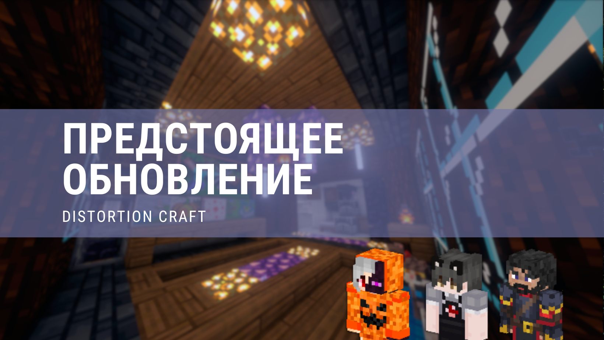

# История обновлений

## 20.06.2023 - Pre-1.20

💥НОВОСТИ о предстоящем обновлении сервера и переходе на Minecraft 1.20!

💬Обновление и переход сервера на новую версию игры подразумевает под собой полный вайп, то есть полный сброс игрового процесса (удаление игрового мира и данных игроков). Иными словами - ВСЕ игроки начнут "с чистого листа". Начав игру с чистого листа игроки смогут полностью окунуться в новые особенности игры.

⚒Тематика сервера не изменяется - Vanilla.

❗После обновления, администрация проекта НИКАК не будет вмешиваться в игровой процесс, и будет помогать исключительно с проблемами и вопросами.

⚔Система кланов останется такой же, какой является сейчас. [1]

🛒Что касается торговли и иных экономических отношений между игроками - валюта не будет вырезана с сервера, но ей нашлось другое применение.
На смену аукциону придет обмен.
Игрок, находясь рядом с другим игроком[2], сможет отправить ему предложение на обмен. Обменивать можно предметы, опыт, а также валюту. Для игроков открывается множество новых возможностей торговли и обмена.
Удаление аукциона связано с тем, что игроки использовали его не по прямому назначению, и он не пользовался большой популярностью.

🚫Будет отключена возможность использования команды /afk для игроков. Связано это с недобросовестным использованием этой команды, к примеру для пропуска ночи. AFK-система остаётся, но статус будет активироваться только тогда, когда игрок действительно отошёл.

🌸В Minecraft 1.20 был добавлен новый биом - Вишнёвые луга[3]. На сервере он также появится, но будет незначительно изменён. Изменения связаны с кастомной генерацией мира на сервере, но кардинально он не изменится.

⛔Никакие аспекты игры не будут изменены или удалены. Вы сможете полноценно насладиться как обновлением игры, так и обновлением сервера.

👀Конечно же, мы хотим услышать мнение игроков проекта. Какое у Вас сложилось впечатление о новой версии Minecraft? Какие идеи ВЫ бы хотели предложить для реализации на сервере? ВСЕ свои идеи и предложения Вы можете расписать в обсуждении, ссылка на которое указана ниже.

❤Спасибо за Ваше терпение и за активную игру на проекте.
Команда Distortion Craft.

[1] - Возможны незначительные изменения
[2] - Расстояние не должно превышать 5 блоков
[3] - Название биома может отличаться

🔗Ссылки:

💬Обсуждение с идеями: https://vk.com/topic-185536557_49431861
📖Вики проекта: https://clck.ru/34iJWQ

🗺Веб-карта: https://clck.ru/34iHjo

👾Discord-сервер: https://clck.ru/34iJbA

✉Teleram-канал: https://clck.ru/34iJgv

🔗Веб-сайт: https://clck.ru/34iN9d

